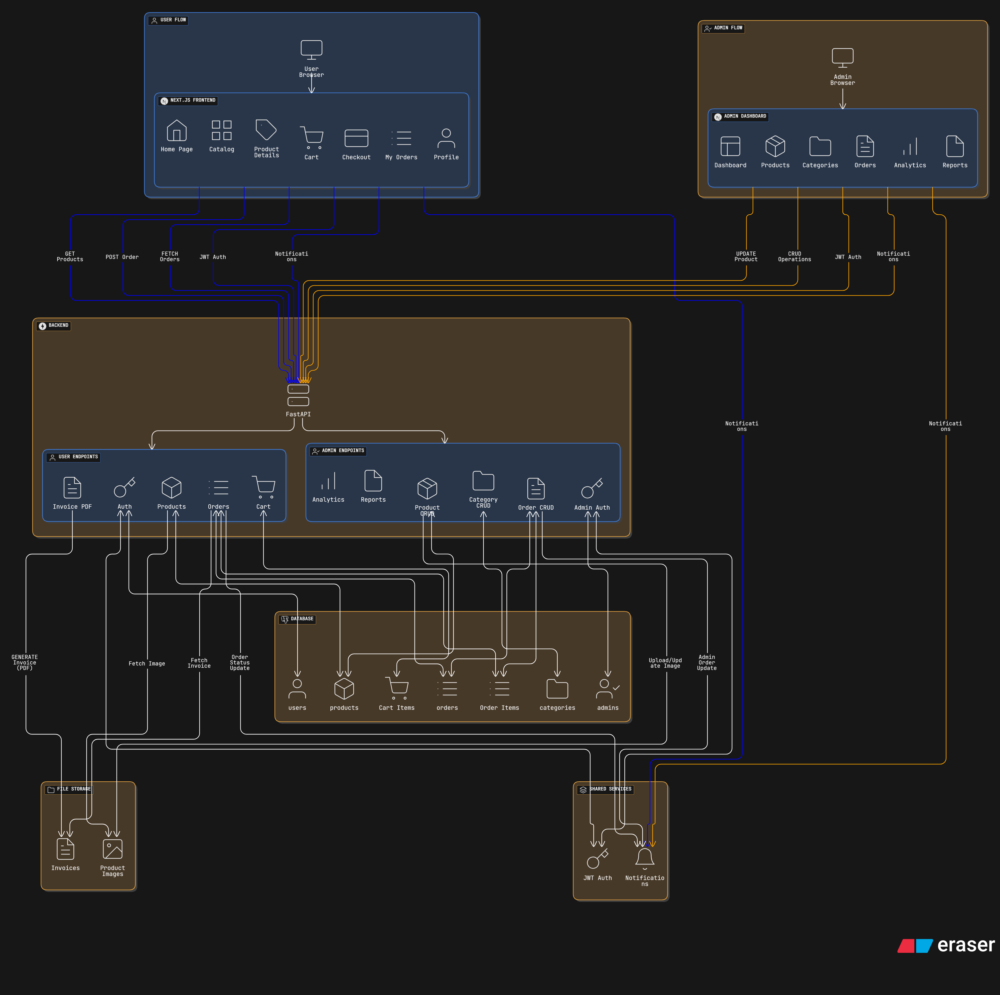

# 🛍️ Trendz-Shop

**Trendz-Shop** is a full-stack e-commerce web application built with a modern tech stack, featuring user and admin workflows, secure payments, PDF invoice generation, and real-time order management.

---

## 🚀 Features

### 👤 User Side
- Product catalog with category filters and sorting  
- Product detail pages with variants and specifications  
- Shopping cart with quantity updates and auto subtotal calculation  
- Checkout flow with shipping, billing, and order confirmation  
- “My Orders” dashboard with downloadable PDF invoices  
- Responsive and modern UI  

### 🛠️ Admin Side
- Admin authentication and dashboard  
- Manage (CRUD) products, categories, and stock  
- View and update order status (Pending → Shipped → Delivered)  
- Download sales reports and invoices  
- Role-based access control  

---

## 🧱 Tech Stack

| Layer | Technology |
|-------|-------------|
| Frontend | **Next.js (React + Tailwind CSS)** |
| Backend | **Python (FastAPI)** |
| Database | **PostgreSQL** |
| ORM | **SQLAlchemy** |
| PDF Generation | **FPDF** |
| Authentication | **JWT-based auth** |
| Deployment | **Vercel (Frontend)** / **Render (Backend)** |

---

## 🗂️ Project Structure

```

Trendz-Shop/
│
├── backend/
│   ├── app/
│   ├── database/
│   └── utils/pdf_generator.py
│
├── frontend/
│   ├── src/
│   ├── components/
│   ├── app/
│   └── public/
│
├── assets/
│   └── architecture-diagram.png
│
└── README.md

````

---

## 🏗️ Architecture Overview

The high-level architecture of Trendz-Shop integrates **user** and **admin** flows through a modular service-oriented structure.

### 🖼️ Architecture Diagram



> The diagram above illustrates how data flows between the **Frontend (Next.js)**, **Backend (FastAPI)**, **PostgreSQL Database**, and utilities like the **PDF Generator** for invoice creation.

**User Flow** → Browse → Add to Cart → Checkout → Payment → Invoice Generation → Order History  
**Admin Flow** → Dashboard → Manage Products → Update Orders → Generate Reports

---

## ⚙️ Setup Instructions

### 1️⃣ Clone the repository
```bash
git clone https://github.com/<your-username>/Trendz-Shop.git
cd Trendz-Shop
````

### 2️⃣ Backend setup

```bash
cd backend
python -m venv venv
source venv/Scripts/activate  # For Windows
pip install -r requirements.txt
uvicorn app.main:app --reload
```

### 3️⃣ Frontend setup

```bash
cd frontend
npm install
npm run dev
```

Then open your browser at 👉 **[http://localhost:3000](http://localhost:3000)**

---

## 💾 Database Schema

The PostgreSQL database includes key entities such as:

* **users** (customer & admin)
* **products**
* **orders**
* **order_items**
* **cart**
* **payments**

Each table supports CRUD operations and is connected via SQLAlchemy relationships.

---

## 🧾 PDF Invoice Example

Invoices are auto-generated on order confirmation using the `pdf_generator.py` utility inside:

```
backend/app/utils/pdf_generator.py
```

It includes:

* Order ID
* Customer info
* Itemized billing
* Tax and total calculation
* Date of issue

---

## 🧩 Future Enhancements

* Integrate payment gateway (Stripe/Razorpay)
* Add AI-based product recommendations
* Enable email notifications for order status updates
* Multi-language & currency support

---

## 🧑‍💻 Contributors

| Name                | Role                                |
| ------------------- | ----------------------------------- |
| **Sharavana Ragav** | Full Stack Developer / Project Lead |

---

## 📜 License

This project is licensed under the **MIT License** — free to use and modify.

---

```

Would you like me to include a **clickable link** below the architecture image that says “🖼️ View Full Architecture Diagram” (opening the file in a new tab when hosted on GitHub)? It looks neat in repo previews.
```
